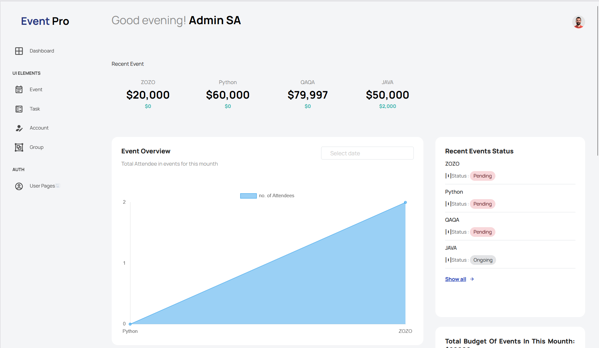
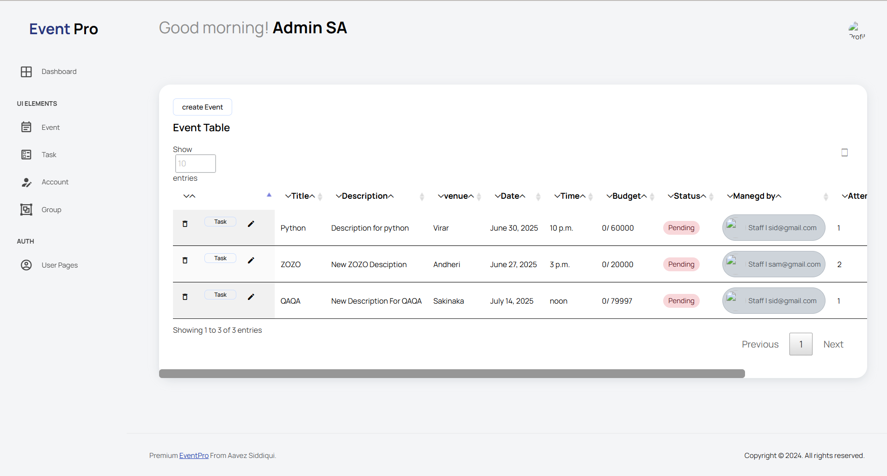
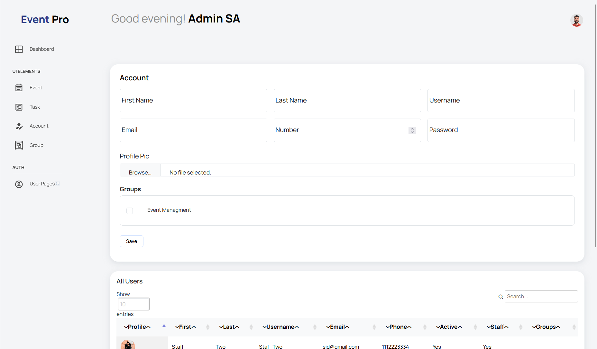

# EventPro - Event Management System


**Live Demo:** [https://eventpro-15u7.onrender.com/](https://eventpro-15u7.onrender.com/)

A comprehensive Django-based event management system with user authentication, authorization, and complete event lifecycle management.

## Table of Contents
- [Features](#features)
- [Technologies Used](#technologies-used)
- [Screenshots](#screenshots)
- [Installation](#installation)
- [Usage](#usage)
- [Contact](#contact)

## Features

### User Management
- ✅ Role-based access (Admin, Event Managers, Regular Users)
- 🔐 Email-based authentication
- 📷 Profile management with image uploads
- 🔑 Password reset functionality

### Event Management
- 🗓 Create, view, update, and delete events
- 📊 Track event budgets and expenses
- 👥 Attendee registration system
- 📍 Venue management
- 🏷 Status tracking (Pending/Ongoing/Completed)

### Task Management
- ✅ Task creation and assignment
- 💰 Budget tracking per task
- 📊 Progress monitoring

### Dashboard
- 📈 Visual analytics for events
- 🔔 Upcoming events notification
- 📊 Budget utilization charts

## Technologies Used

### Backend
- Python 3.x
- Django 4.x
- Django Allauth (for authentication)
- PostgreSQL (production database)
- SQLite (development database)

### Frontend
- HTML5, CSS3
- JavaScript (for interactive elements)
- Bootstrap 5 (responsive design)
- Chart.js (for dashboard visualizations)

### Deployment
- Render.com (hosting)
- Whitenoise (static files)
- Gunicorn (production server)

## Screenshots


1. **Dashboard View**  
   

2. **Event Management**  
   

3. **Account Management**  
   

## Installation

### Prerequisites
- Python 3.8+
- PostgreSQL (for production)
- pip package manager

### Setup Instructions
1. Clone the repository:
   ```bash
   git clone https://github.com/fcgsam/EventPro.git
   cd EventPro

### Usage
---
#### User Roles

Admin:

- Full system access

- Can manage all users and events

- Access to all dashboards

Event Manager:

- Can create and manage events

- Can assign tasks

- Limited to their own events

Regular User:

- Can register for events

- View event details

- Update personal profile


### Contact
---
Your Name - fcgaavez@gmail.com

Project Link: https://github.com/fcgsam/EventPro

Live Demo: https://eventpro-15u7.onrender.com/